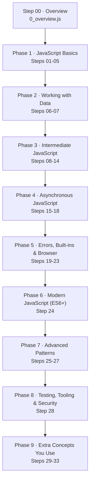

# 🗺️ JavaScript Roadmap — Step by Step

A hands-on, **ordered** roadmap for learning JavaScript: `0_overview.js` + **33 lesson files** (9 phases).
Every lesson is one runnable `.js` file with the same readable structure:

> **Theory → Runnable examples → Expected output → Common mistakes → Interview questions → Practice + answers → Next step**

You learn by **running and breaking** the code, not just by reading it. 🙂

---

## 📖 Table of contents

1. [Quick start](#-quick-start)
2. [Roadmap at a glance](#-roadmap-at-a-glance)
3. [How the lessons are written](#-how-the-lessons-are-written)
4. [All 28 steps — progress tracker](#-all-28-steps--progress-tracker)
5. [Phase details](#-phase-details)
6. [Suggested schedule](#-suggested-schedule)
7. [Checkpoint projects](#-checkpoint-projects)
8. [Commands cheat-sheet](#-commands-cheat-sheet)
9. [Resources](#-resources)

---

## 🚀 Quick start

```bash
# 0. Requirement: Node.js 18+   (check with: node --version)
node 0_overview.js                 # or: npm start   -> prints this roadmap
npm run all                        # runs all 28 lessons in order + pass/fail report
npm run lesson -- 3_operators.js   # run one lesson   (or simply: node 3_operators.js)
```

Rules that make this repo work:

* Run **one lesson at a time, in order** — each step builds on the previous one.
* Read the theory block, then run the file and compare with the *EXPECTED OUTPUT* section.
* Change a value, predict the result, run again. Predict → run → compare.
* Do the **PRACTICE** tasks at the bottom of each file before moving on.
* Tick the box next to that step in the [progress tracker](#-all-28-steps--progress-tracker).

---

## 🗺️ Roadmap at a glance



| Phase | Focus | Steps | You can build after it |
| :---- | :---- | :---- | :---- |
| 1 | Language basics: values, types, logic, loops, functions | 01–05 | A CLI calculator / unit converter |
| 2 | Arrays & objects — the real data structures of JS | 06–07 | An in-memory todo list |
| 3 | How JS *thinks*: scope, hoisting, closures, `this`, prototypes | 08–14 | A tiny state store / module pattern |
| 4 | Async JavaScript: callbacks → promises → `async/await` | 15–18 | A data fetcher with retry + loading states |
| 5 | Error handling, Date, DOM and browser APIs | 19–23 | A browser app that persists its state |
| 6 | Modern syntax: the ES6+ features you use daily | 24 | The same app, refactored into modules |
| 7 | Patterns: debounce, currying, Set/Map | 25–27 | A search box with debounce + caching |
| 8 | Testing, debugging, performance and security | 28 | A tested, deploy-ready project |
| 9 | IIFE, recursion, regex, string/number toolkit, design patterns | 29–33 | A small utility library + an event-driven mini app |

---

## 🧩 How the lessons are written

Every numbered file uses the same sections, so your eye always knows where to look:

| Section | What it contains | What you do with it |
| :---- | :---- | :---- |
| **HEADER** | Step number, phase, learning goals, run command, next step | Know where you are |
| **1 · THEORY** | Definition, why it matters, syntax, gotchas | Read first |
| **2 · EXAMPLES** | Copy-paste-runnable code with `// -> output` comments | Run it |
| **3 · EXPECTED OUTPUT** | The console output of the file | Verify your run |
| **4 · COMMON MISTAKES** | The bugs that bite everyone | Avoid them |
| **5 · INTERVIEW QUESTIONS** | Concept + code questions with short answers | Self-test |
| **6 · PRACTICE + ANSWERS** | Small tasks, solutions at the bottom | Do them, then peek |

Naming convention: `<step>_<topic>.js` — `10_closures.js` is **step 10**.

## ✅ All 33 steps — progress tracker

Tick a box only after you have run the file **and** finished the practice tasks.

### Phase 1 · JavaScript Basics

- [ ] `01` **Variables** — [`1_variables.js`](./1_variables.js) — `let` / `const` / `var`, block scope, TDZ, mutation vs reassignment
- [ ] `02` **Data Types** — [`2_data_types.js`](./2_data_types.js) — 7 primitives, objects, `typeof`, coercion, truthy/falsy
- [ ] `03` **Operators** — [`3_operators.js`](./3_operators.js) — arithmetic, comparison, logical, `??`, `?.`, logical assignment
- [ ] `04` **Control Flow** — [`4_control_flow.js`](./4_control_flow.js) — `if`/`switch`, `for`/`while`/`for..of`/`for..in`, labels
- [ ] `05` **Functions** — [`5_functions.js`](./5_functions.js) — declarations, expressions, arrow, IIFE, rest, closures (deep dive)

### Phase 2 · Working with Data

- [ ] `06` **Arrays** — [`6_arrays.js`](./6_arrays.js) — CRUD, `map`/`filter`/`reduce`, `sort`, `find`, spread, immutability
- [ ] `07` **Objects** — [`7_objects.js`](./7_objects.js) — keys/values/entries, copies, optional chaining, JSON

### Phase 3 · Intermediate JavaScript

- [ ] `08` **Scope** — [`8_scope.js`](./8_scope.js) — global/function/block, lexical scope, shadowing, `var` leaks
- [ ] `09` **Hoisting** — [`9_hoisting.js`](./9_hoisting.js) — `var` vs `let`/`const`, TDZ, function hoisting
- [ ] `10` **Closures** — [`10_closures.js`](./10_closures.js) — private state, factories, the loop pitfall
- [ ] `11` **The `this` Keyword** — [`11_this_keyword.js`](./11_this_keyword.js) — 5 binding rules, `call`/`apply`/`bind`, arrow `this`
- [ ] `12` **Prototypes & Inheritance** — [`12_prototypes_and_inheritance.js`](./12_prototypes_and_inheritance.js) — prototype chain, `class`, `extends`, `super`
- [ ] `13` **Higher-Order Functions** — [`13_higher_order_functions.js`](./13_higher_order_functions.js) — pure functions, wrappers, composition
- [ ] `14` **Destructuring & Spread/Rest** — [`14_destructuring_and_spread_rest.js`](./14_destructuring_and_spread_rest.js) — patterns, defaults, shallow vs deep copy

### Phase 4 · Asynchronous JavaScript

- [ ] `15` **Callbacks** — [`15_callbacks.js`](./15_callbacks.js) — callback style, error-first convention, callback hell
- [ ] `16` **Promises** — [`16_promises.js`](./16_promises.js) — states, `then/catch/finally`, chaining, `all`/`race`/`allSettled`
- [ ] `17` **async / await** — [`17_async_await.js`](./17_async_await.js) — `try/catch`, sequential vs parallel, returning promises
- [ ] `18` **Event Loop & Call Stack** — [`18_event_loop_and_call_stack.js`](./18_event_loop_and_call_stack.js) — microtasks vs macrotasks, starvation

### Phase 5 · Errors, Built-ins & Browser

- [ ] `19` **try / catch / finally** — [`19_try_catch_finally.js`](./19_try_catch_finally.js) — throwing, catching, `finally`, async errors
- [ ] `20` **Custom Errors** — [`20_custom_error.js`](./20_custom_error.js) — `Error` subclasses, `instanceof`, `cause`, retry patterns
- [ ] `21` **Date & Time** — [`21_date_and_time.js`](./21_date_and_time.js) — `Date`, timestamps, `Intl.DateTimeFormat`, durations
- [ ] `22` **DOM Manipulation** — [`22_dom_manipulation.js`](./22_dom_manipulation.js) — selecting, creating, events, delegation
- [ ] `23` **Browser APIs** — [`23_browser_apis.js`](./23_browser_apis.js) — `localStorage`, `fetch`, timers, `AbortController`

### Phase 6 · Modern JavaScript (ES6+)

- [ ] `24` **ES6+ Features** — [`24_es6_features.js`](./24_es6_features.js) — arrow, template literals, modules, iterators, async generators

### Phase 7 · Advanced Patterns

- [ ] `25` **Debounce & Throttle** — [`25_debounce.js`](./25_debounce.js) — timers, cleanup, `cancel`/`flush`
- [ ] `26` **Currying & Partial Application** — [`26_currying.js`](./26_currying.js) — closures in action, `bind` vs curry
- [ ] `27` **Set & Map** — [`27_set_map.js`](./27_set_map.js) — unique values, keyed collections, `WeakMap` caching

### Phase 8 · Testing, Tooling & Security

- [ ] `28` **Testing & Debugging** — [`28_testing_and_debugging.js`](./28_testing_and_debugging.js) — assertions, table tests, `console` tools, tooling & security checklist

### Phase 9 · Extra Concepts You Use Daily

- [ ] `29` **IIFE & Module Patterns** — [`29_iife_and_module_patterns.js`](./29_iife_and_module_patterns.js) — private scope, revealing module, singleton, `async` IIFE
- [ ] `30` **Recursion & Memoization** — [`30_recursion_and_memoization.js`](./30_recursion_and_memoization.js) — base cases, call stack, trees, caches
- [ ] `31` **Regular Expressions** — [`31_regular_expressions.js`](./31_regular_expressions.js) — flags, groups, `test`/`match`/`replace`, validation, escaping
- [ ] `32` **Strings & Numbers** — [`32_strings_and_numbers.js`](./32_strings_and_numbers.js) — string API, parsing, `Math`, money in cents, `Intl`
- [ ] `33` **Common Design Patterns** — [`33_common_design_patterns.js`](./33_common_design_patterns.js) — factory, singleton, observer, strategy, pipeline, decorator

---

## 📚 Phase details

Each step is self-contained, but the *phase* is the real learning unit: finish it, then build the phase's project.
"Est." is a comfortable time for someone who is new to the topic.

### Phase 1 · JavaScript Basics (Steps 01–05) — start here

| # | Lesson | Concepts | Est. |
| :-- | :---- | :---- | :-- |
| 01 | [Variables](./1_variables.js) | declaration vs assignment, `let`/`const`/`var`, block scope, TDZ, naming rules, `const` object mutation | 25 min |
| 02 | [Data Types](./2_data_types.js) | 7 primitives, `typeof` quirks, `NaN`, `BigInt`, `Symbol`, reference types, truthy/falsy, `Object.is` | 40 min |
| 03 | [Operators](./3_operators.js) | arithmetic, assignment, comparison (`==` vs `===`), logical + short-circuit, `??`, `?.`, `&&=`/`||=`, ternary | 45 min |
| 04 | [Control Flow](./4_control_flow.js) | `if`/`else`, ternary, `switch`, `for`, `while`, `do..while`, `for..of`, `for..in`, `break`/`continue`, labels | 45 min |
| 05 | [Functions](./5_functions.js) | declarations, expressions, arrow, anonymous, IIFE, params/args, `return`, defaults, rest, closures, `this` | 90 min |

**Golden rule of Phase 1:** when unsure about a value, `console.log(typeof value, value)`.

### Phase 2 · Working with Data (Steps 06–07)

| # | Lesson | Concepts | Est. |
| :-- | :---- | :---- | :-- |
| 06 | [Arrays](./6_arrays.js) | indexing, `push`/`pop`/`shift`/`unshift`/`splice`/`slice`, `map`/`filter`/`reduce`/`find`/`some`/`every`, `sort` comparator, spread, copies | 60 min |
| 07 | [Objects](./7_objects.js) | dot vs bracket access, computed keys, methods, `Object.keys/values/entries`, destructuring, spread, shallow vs deep copy, `structuredClone`, JSON | 60 min |

**Why this phase matters:** arrays and objects *are* the data of every app. Most "JS logic" bugs are array/object reference bugs (step 14 closes that loop).

### Phase 3 · Intermediate JavaScript (Steps 08–14)

| # | Lesson | Concepts | Est. |
| :-- | :---- | :---- | :-- |
| 08 | [Scope](./8_scope.js) | global/function/block scope, lexical scope, shadowing, scope chain, module scope, `var` leaks | 30 min |
| 09 | [Hoisting](./9_hoisting.js) | hoisted `var` (`undefined`) vs TDZ, function declaration hoisting, function expressions are not hoisted | 30 min |
| 10 | [Closures](./10_closures.js) | lexical environment, private state, factories, `var`-in-loop pitfall, closures in event handlers | 45 min |
| 11 | [`this`](./11_this_keyword.js) | default/implicit/explicit/`new` binding, arrow functions capture lexical `this`, `call`/`apply`/`bind`, lost `this` | 50 min |
| 12 | [Prototypes & Inheritance](./12_prototypes_and_inheritance.js) | `__proto__` vs `prototype`, prototype chain lookups, constructor functions, `class`/`extends`/`super`, `instanceof` | 60 min |
| 13 | [Higher-Order Functions](./13_higher_order_functions.js) | functions as values, pure vs impure, wrappers/decorators, `compose`/`pipe`, `once`/`memoize` | 45 min |
| 14 | [Destructuring & Spread/Rest](./14_destructuring_and_spread_rest.js) | object/array patterns, renaming, defaults, nested patterns, `...` copies vs shared references | 45 min |

**This phase separates beginners from confident developers.** Re-run each file until you can predict every line.

### Phase 4 · Asynchronous JavaScript (Steps 15–18)

| # | Lesson | Concepts | Est. |
| :-- | :---- | :---- | :-- |
| 15 | [Callbacks](./15_callbacks.js) | higher-order callbacks, error-first style, nesting ("callback hell"), why promises came next | 40 min |
| 16 | [Promises](./16_promises.js) | pending/fulfilled/rejected, `then`/`catch`/`finally`, chaining, error propagation, `Promise.all`/`allSettled`/`race`/`any` | 60 min |
| 17 | [async / await](./17_async_await.js) | `async` returns a promise, `await`, `try/catch`, sequential vs parallel (`Promise.all`), loops with `await` | 60 min |
| 18 | [Event Loop & Call Stack](./18_event_loop_and_call_stack.js) | call stack, Web APIs, task queue vs microtask queue, `setTimeout(…, 0)`, starvation, surprising order | 45 min |

**Rule of thumb:** `async/await` for readability, `Promise.all` for speed, `try/catch` for safety.

### Phase 5 · Errors, Built-ins & Browser (Steps 19–23)

| # | Lesson | Concepts | Est. |
| :-- | :---- | :---- | :-- |
| 19 | [try / catch / finally](./19_try_catch_finally.js) | `throw` any value, catching, `finally` always runs, optional `catch` binding, async errors | 40 min |
| 20 | [Custom Errors](./20_custom_error.js) | extending `Error`, `name`/`message`/`cause`, `instanceof`, central error handling, retries with backoff | 45 min |
| 21 | [Date & Time](./21_date_and_time.js) | `Date.now()`, ISO strings, UTC vs local, `Intl.DateTimeFormat`, arithmetic with timestamps | 45 min |
| 22 | [DOM Manipulation](./22_dom_manipulation.js) | `querySelector`, creating/appending nodes, `textContent` vs `innerHTML` (XSS), classes, events, delegation | 60 min |
| 23 | [Browser APIs](./23_browser_apis.js) | `localStorage`/`sessionStorage` + JSON, `fetch` + status codes, `AbortController`, timers, `navigator` | 60 min |

> Browser lessons (22, 23) are **guarded** so they still run under Node: they detect the missing `document`/`localStorage`, print a "run this in the browser" notice, and still execute the logic that works everywhere.

### Phase 6 · Modern JavaScript (Step 24)

| # | Lesson | Concepts | Est. |
| :-- | :---- | :---- | :-- |
| 24 | [ES6+ Features](./24_es6_features.js) | arrow functions, template literals, destructuring, spread, default/rest params, shorthand methods, computed keys, optional chaining, `??`, ES modules, iterators/generators | 60 min |

### Phase 7 · Advanced Patterns (Steps 25–27)

| # | Lesson | Concepts | Est. |
| :-- | :---- | :---- | :-- |
| 25 | [Debounce & Throttle](./25_debounce.js) | timers, "last call wins", leading/trailing edge, `cancel`/`flush`, throttle with a time window | 45 min |
| 26 | [Currying & Partial Application](./26_currying.js) | curry vs partial application, closures, `bind` for partial application, composing curried functions | 45 min |
| 27 | [Set & Map](./27_set_map.js) | unique values, `Set` operations, `Map` vs object keys, iteration order, `WeakMap`/`WeakSet` caching | 40 min |

### Phase 8 · Testing, Tooling & Security (Step 28)

| # | Lesson | Concepts | Est. |
| :-- | :---- | :---- | :-- |
| 28 | [Testing & Debugging](./28_testing_and_debugging.js) | `assert` helpers, table-driven tests, edge cases, `console.table`/`time`, tooling (npm, Vite, ESLint, Prettier, Vitest), security & performance checklist | 60 min |

### Phase 9 · Extra Concepts You Use Daily (Steps 29–33)

| # | Lesson | Concepts | Est. |
| :-- | :---- | :---- | :-- |
| 29 | [IIFE & Module Patterns](./29_iife_and_module_patterns.js) | `(function(){})()` syntax, private scope, `!`/`void` prefixes, revealing module, singleton, `"use strict"`, async IIFE | 40 min |
| 30 | [Recursion & Memoization](./30_recursion_and_memoization.js) | base/recursive cases, the call stack, trees & nested data, deep clone, `memoize()`, stack overflow | 50 min |
| 31 | [Regular Expressions](./31_regular_expressions.js) | literals vs `new RegExp`, flags, classes/quantifiers/anchors, groups, `test`/`match`/`matchAll`/`replace`, escaping input, `/g` state trap | 60 min |
| 32 | [Strings & Numbers](./32_strings_and_numbers.js) | the string API, template building, `Number` vs `parseInt`, `Math` rounding/clamp/random, money in cents, `Intl.NumberFormat` | 50 min |
| 33 | [Common Design Patterns](./33_common_design_patterns.js) | factory, singleton, observer/pub-sub, strategy, pipeline/middleware, decorator (retry) | 60 min |

---

## 🗓️ Suggested schedule

| Week | Steps | Goal |
| :-- | :-- | :-- |
| 1 | 01–05 | Be fluent with values, logic and functions |
| 2 | 06–07 (+ re-do 05) | Transform data with arrays/objects without looking things up |
| 3 | 08–14 | Explain scope, closures, `this` and prototypes out loud |
| 4 | 15–18 | Write async code with promises and `async/await` |
| 5 | 19–23 | Handle errors, dates, DOM and browser storage |
| 6 | 24–28 | Modern syntax, patterns, testing and tooling |
| 7 | 29–33 | The daily-coding extras: IIFE, recursion, regex, formatting, patterns |

Rhythm per step: **read (5 min) → run (5 min) → practice (15 min) → explain it to someone / write 3 lines of notes**.

---

## 🛠️ Checkpoint projects

Build these **without** looking at your lessons; only peek when stuck.

1. **After Phase 1–2** — CLI "expense tracker": an array of objects, `filter`/`reduce` for totals, a `switch` menu.
2. **After Phase 3** — `createCounter()` / `createStore()` built with closures, plus a `class Animal` hierarchy.
3. **After Phase 4** — `fetchWithRetry(url, retries)` using `async/await`, with timeout and `Promise.all` batching.
4. **After Phase 5** — Todo app in the browser: DOM rendering + `localStorage` persistence + input validation.
5. **After Phase 6–7** — Refactor it into ES modules, add a debounced search box and a `Map`-based cache.
6. **After Phase 8** — Add tests for the pure functions, run ESLint/Prettier, then do a security pass (never `innerHTML` user data, always validate input).
7. **After Phase 9** — Extract a tiny `utils/` library from your lessons (slugify, formatMoney, randomId, clamp, event emitter) with tests for each helper.

---

## ⌨️ Commands cheat-sheet

```bash
node 0_overview.js                 # print the roadmap              (npm start)
node 3_operators.js                # run one lesson — that is all you need most days
npm run lesson -- 16_promises.js   # the same thing through npm
npm run all                        # run all 33 lessons in order + pass/fail summary
npm run all -- --summary           # summary only, hide each lesson's output
node --check 5_functions.js        # syntax check without running
node --watch 3_operators.js        # re-run automatically on every save
```

---

## 🔗 Resources

* MDN JavaScript reference — <https://developer.mozilla.org/en-US/docs/Web/JavaScript>
* ECMAScript language specification — <https://tc39.es/ecma262/>
* javascript.info — deep dives that pair well with steps 08–18
* Node.js docs — <https://nodejs.org/docs/latest/api/>
* Browser compatibility data — <https://caniuse.com/>

---

*Repo layout: `README.md` (this roadmap) · `0_overview.js` (runnable map) · 33 numbered lessons · `run-all.js` (runner) · `package.json` (scripts).*
*Keep this file up to date as you progress — the checkboxes are your record.*


